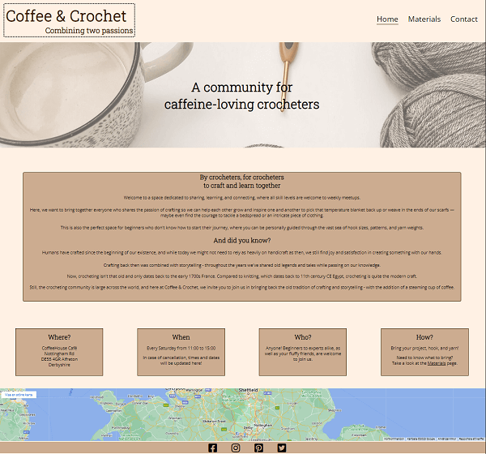
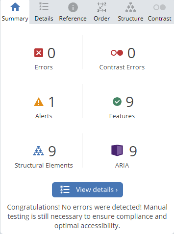

# Coffee & Crochet website

Full responsive site [here](https://ui.dev/amiresponsive?url=https://aurorastorm-sw.github.io/Portfolio-project-1/)

### [Full website here](https://aurorastorm-sw.github.io/Portfolio-project-1/index.html)

# Table of contents

- [UX](#ux)
    - [Website owner goals](#website-owner-goals)
    - [User goals](#user-goals)
        - [First-time visitor goals](#first-time-visitor-goals)
        - [Returning visitor goals](#returning-visitor-goals)
    - [User stories](#user-stories)
        - [As a website owner](#as-a-website-owner)
        - [As a new user](#as-a-new-user)
        - [As a returning user](#as-a-returning-user)
- [Wireframes](#wireframes)
- [Designs](#designs)
    - [Colors](#colors)
    - [Fonts](#fonts)
    - [Images](#images)
- [Features](#features)
    - [Home](#home)
    - [Materials](#materials)
    - [Contact](#contact)
    - [Logo](#logo)
    - [Navigation bar](#navigation-bar)
    - [Footer](#footer)
        - [Features left to implement](#features-left-to-implement)
- [Testing](#testing)
    - [Validator testing](#validator-testing)
    - [Manual testing](#manual-testing)
    - [Lighthouse testing](#lighthouse-testing)
    - [Wave testing](#wave-testing)
    - [Bugs](#bugs)
- [Deployment](#deployment)
- [Tools](#tools)
- [Credits](#credits)

# UX

## Website owner goals

The reason for creating this website is to invite people who enjoy crocheting, no matter their skill level, to join a community with similar interests where they can learn new skills and start new projects and work on ongoing projects. Having a community can help in boosting creativity and bring inspiration. It is also a perfect space to share knowledge and learn tricks and tips from each other. This website will allow people to sign up for meetups and also provide their skill level so the organizer can prepare to give them the proper attention.

## User goals

## First-time visitor goals:
- users can learn what the meetups are about
- users can learn about the location of the meetups
- understand if the meetups are for someone of my skill level

## Returning visitor goals:
- users can message the meetup coordinator with questions and feedback

## User stories

## As a website owner:

- I would like to present the page in a way that makes new users feel welcome to join meetups no matter what skill level they're currently at
- I want beginners to feel comfortable knowing what materials to bring to meetups
- I want to help users connect via meetups to share knowledge and experiences
- I would like to build a community where people feel comfortable sharing their crocheting journey

## As a new user:

- I want to know where and when the meetups are held
- I may need to know what materials to bring to a meetup in case something is available on the spot or if I need to bring all materials myself
- I need to be able to contact the organizer about any questions regarding meetups and materials

## As a returning user:
- I need to know if any meetups are cancelled beforehand
- I want to be able to send questions or feedback to the organizer

# Wireframes

All wireframes are made with Balsamiq Wireframes. 

## Home

## Materials

## Contact

## Thank You

# Designs

## Colors

My main goal for the colors was to make the page feel welcoming and cozy, as well as not too bright or dark.

The colors used for the page are inspired by three different shades of coffee, one with milk and one without. The dark shade is used for logo and navbar elements and as borders.

The medium shade is used as background color for text sections and the contact form.

The lightest shade is used as background color for the body.

## Fonts
When picking fonts, I looked for ones that sparked feelings of "casual" yet "creative" without going overboard. I searched different serif fonts on [Google Fonts](https://fonts.google.com/)

The first pick was Roboto Slab, light 300, for big headings. This font I used with the [Font Joy generator](https://fontjoy.com/) and found my second font Open Sans which is used for the slogan as well as paragraphs and smaller headings. 

Both fonts are backed up with 'Serif'.

## Images

I picked this as the banner for the home page because the colors are calm and easy on the eyes, and the image displays what the website is built for; crocheting and coffee.

The search for a perfect banner for the materials page was long, but I fell for this one since it includes all the necessary items for crocheting laid out in a very nice way.

Each image for the Materials page was picked to make the most sense in regard to each paragraph of information.

The image I found for the contact banner I found also fits the calm, cozy feel without any colors that are too strong or overwhelming.

# Features

The website is made up of 4 pages;

- Home

The home page includes a short history about crocheting and how crafting in history has been done in the company of a community.
Beneath is 4 boxes including information about where the meetups are held, where, who can join, and what to bring.

From the start, there were three separate boxes with information about the time and place of the meetups. This was changed into a 4 column layout as the previous one was difficult to style in a satisfying way.

- Materials

 

The materials page includes a list of recommended materials to bring to a meetup, including yarn, crochet hooks, scissors, and patterns.

In a later stage, I added "Stitch markers" to the list.

- Contact

The contact page is made up of a simple contact form that brings the user to a thank you message once the message is sent.

- A Thank you page

 

## Logo

Across all pages is the logo that's been decorated with a dotted border to make it stand out from the rest of the content and also decorate the text.

## Navigation bar

 

Across all pages is the navigation bar with minimalistic styling. Since the logo is decorated, it felt safest to go with a low-key design for the navigation bar. It includes three links to Home, Materials, and Contact.

## Footer
 

The footer is made up of 4 social media links and a google maps bar connected to a made-up address. The map is only located on the home and contact pages, whereas the social media links are added to each page.

# Features Left To Implement
- A proper time schedule with booking 
- Application to mentor beginners

# Testing

## Validator testing
 [See full HTML validation here](https://validator.w3.org/nu/?doc=https%3A%2F%2Faurorastorm-sw.github.io%2FPortfolio-project-1%2F)

 See comment on errors below.

 
 [See full CSS validation here](https://jigsaw.w3.org/css-validator/validator?uri=https%3A%2F%2Faurorastorm-sw.github.io%2FPortfolio-project-1%2F&profile=css3svg&usermedium=all&warning=1&vextwarning=&lang=en)

[Contrast check](https://contrast-grid.eightshapes.com/)

## Lighthouse testing

[Full test here](https://www.webpagetest.org/result/230223_AiDcNW_978/#Performance)

## Wave testing

[Full test here](https://wave.webaim.org/report#/https://aurorastorm-sw.github.io/Portfolio-project-1/index.html)

## Manual Testing

The website has been manually tested for responsiveness across Firefox, Google Chrome, and Edge on PC and on mobile on Samsung Galaxy S20.

# Bugs

## Fixed bugs
- The content of the Thank you page wasn't full enough to push the footer all the way down to the bottom of the page. I got help from a tutor to create a vh style setting to push the footer down.
- The content of the Materials page was at first sectioned into two separate columns side by side with images on the left and text on the right. When working on making the page responsive, the text broke off in weird ways, and it was difficult to style. I resorted to stacking the columns on top of each other, and so the page was responsive from the start.

## Bugs remaining 
- iframe link to Google Maps gives bad values and triggers errors on the HTML validator. I haven't been able to change the link in a way that it remains responsive on-site without removing the values from the link. Decided to leave it be as it doesn't visually affect the rest of the website.

- Google Maps ifame includes a strip of white space between the map and the media icons that I haven't found any way to fix. After testing, it seems to be part of the map link.

## Deployment

This project was deployed via GitHub Pages and the Gitpod browser, used as a development environment. From here I could commit and push my changes throughout the project.

Steps I took to deploy my website;

- Go to the repository for  Portfolio-project-1
- Click the Settings tab and locate the Pages tab
- Select to deploy from main branch
- A few minutes later, upon refreshing the page, my site was live

## Tools
- https://balsamiq.com/ - Balsamiq Wireframes
- https://tinypng.com/ - Image compression
- https://ui.dev/amiresponsive - Responsiveness testing
- https://jigsaw.w3.org/css-validator/validator - CSS validation
- https://validator.w3.org/ - HTML validator
- https://contrast-grid.eightshapes.com/ - Contrast checker
- https://developer.chrome.com/docs/devtools/ - Responsiveness testing/bug searching throughout the process
- https://www.freecodecamp.org/ - Correctly setting footer on Thankyou.html
- https://www.w3schools.com/ & https://developer.mozilla.org/en-US/ - Visited several times during the projet to help get codes written correctly.

# Credits

- ReadMe layout inspiration picked from various projects from other Code Institute students from the #peer-code-review forum and https://github.com/kera-cudmore/readme-examples/blob/main/milestone1-readme.md#deployment

- Code institute's template: https://github.com/Code-Institute-Org/gitpod-full-template

Flavicon:

- https://www.flaticon.com/

Fonts:

 - https://fonts.google.com/

How to position banner and image text:
- https://www.w3schools.com/howto/howto_css_image_text.asp

Column layout:
- https://www.w3schools.com/howto/howto_css_two_columns.asp

 Contact form template HTML and CSS:

- https://github.com/FormBold/html-form-examples-templates 
- https://formbold.com/templates/contact-form

"Thank you for getting in touch" message inspired by:
- https://medium.com/tips-and-tricks-about-online-forms/5-thank-you-messages-to-use-on-your-web-forms-32c18f00426c

Generated fake address by:
- https://www.fakexy.com/fake-address-generator-uk

Map:
- https://www.google.com/maps location Derbyshire

Images:
- Hero banner from rockonwool: 
https://unsplash.com/photos/4u10efCKY-g

- Material banner from Edz Norton:
https://unsplash.com/photos/9rStyyFGKQA

- Contact banner from Merylove Art:
https://unsplash.com/photos/GpcYw1xBES0

- Yarn image from Castorly Stock:
https://www.pexels.com/photo/close-up-photo-of-teal-yarn-3693214/

- Crochet hook image from Knit Pro: 
https://unsplash.com/photos/kN6kOIfyntk

- Scissor image from Karolina Grabowska:
 https://www.pexels.com/photo/small-golden-scissors-on-beige-surface-4226910/

 - Stitch marker image by me

- Pattern image from Anete Lusina:
https://www.pexels.com/photo/crochet-and-thread-on-magazine-in-daytime-4792085/

Sources:

- History of crocheting: 
https://crochetpenguin.com/history-of-crochet/
- History of knitting: 
https://knitlikegranny.com/knitting-history/#EarlyOrigins

- Picking the right yarn:
https://www.thesprucecrafts.com/best-yarn-for-crochet-979065

- Wool yarn use:
https://www.vedantu.com/evs/uses-of-wool
- Cotton yarn use:
https://blog.nobleknits.com/blog/cotton-yarn-guide
- Acrylic yarn use:
https://www.thesprucecrafts.com/best-yarn-for-crochet-979065

- Crochet hooks use:
https://www.createforless.com/buying-guides/crochet-knitting-and-other-needlework/crochet-hooks.aspx
