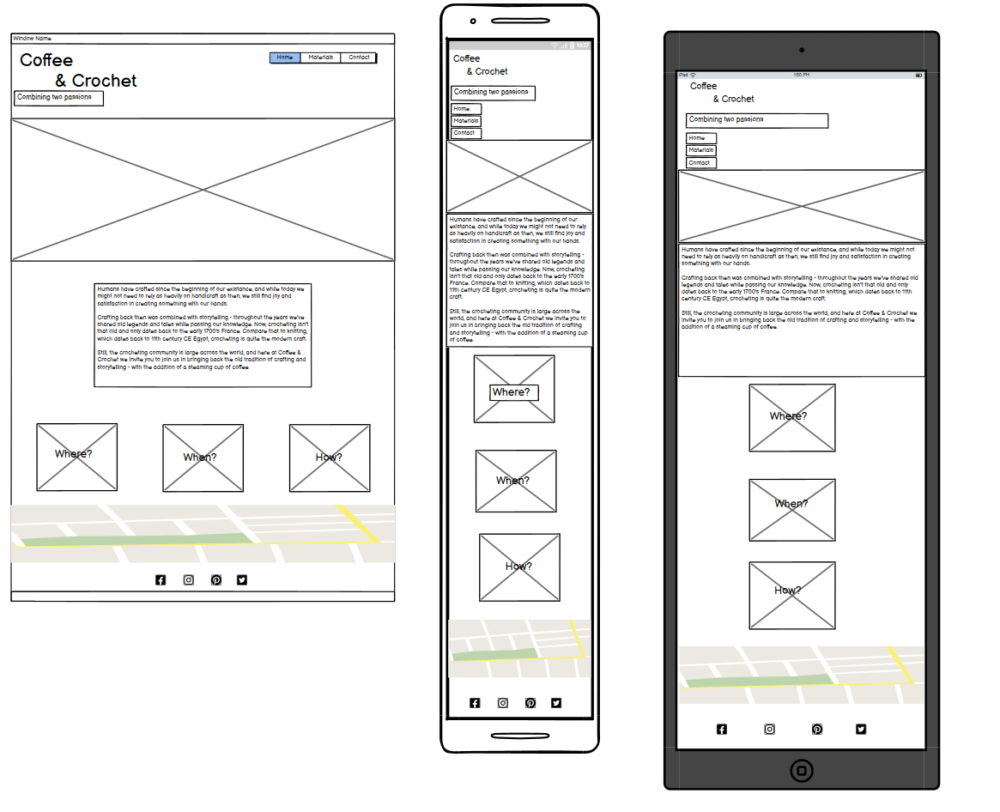
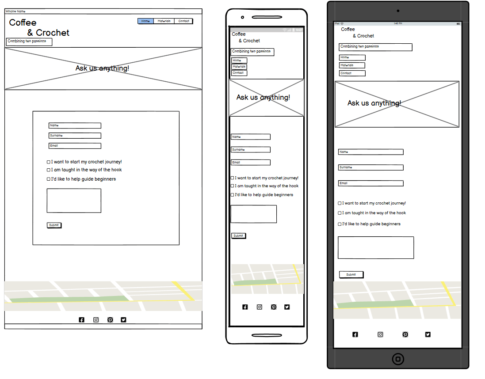
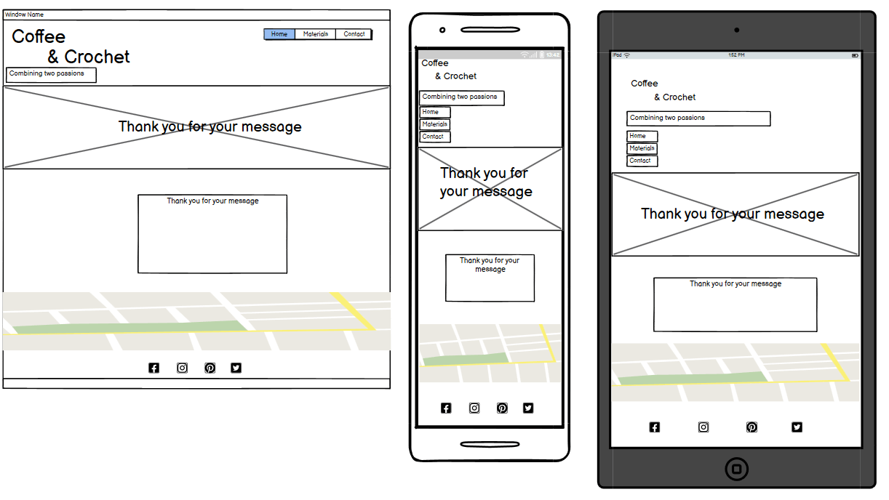
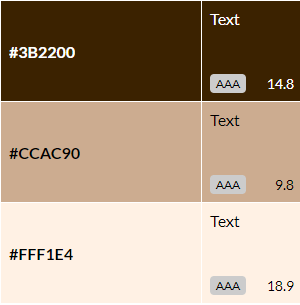
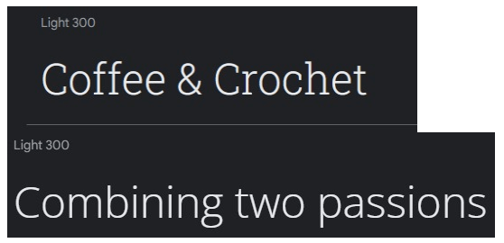

# Crochet & Coffee website

# Table of contents

- [UX](#ux)
    - [Website owner goals](#website-owner-goals)
    - [User goals](#user-goals)
        - [First time visitor goals](#first-time-visitor-goals)
        - [Returning visitor goals](#returning-visitor-goals)
    - [User stories](#user-stories)
        - [As a website owner](#as-a-website-owner)
        - [As a new user](#as-a-new-user)
        - [As a returning user](#as-a-returning-user)
- [Wireframes](#wireframes)
- [Designs]
    - [Colors]
    - [Fonts]
    - [Images]
- [Features]
    - [Home]
        - [Time and location information]
        - [Short history of crocheting]
    - [Materials]
        - [Information of what materials to bring
    - [Contact]
        - [Contact form]
        - [Thank You for your message page]
    - [Navigation bar]
    - [Footer]
    - [Features left to implement]
- [Testing]
    - [Contrast check]
    - [HTML Validation]
    - [CSS Validation]
     - [Manual Testing]
        - [Lighthouse testing]
        - [Wave testing]
    - [Fixed bugs]
- [Tools](#tools)
- [Credits](#credits)

# UX

## Website owner goals

The reason to create this website is to invite people who enjoy crocheting, no matter their skill level, to join a community with similar interests where they can learn new skills and start new projects and work on ongoing projects. Having a community can help in boosting creativity and bring inspiration. It is also a perfect space to share knowledge and learn tricks and tips from each other. This website will allow people to sign up to meet-ups and also provide their skill-level so the organizer can prepare to give them the proper attention.

## User goals

## First time visitor goals:
- users can learn what materials they need to bring to a meet-up
- users can find the location, times and dates for meet-ups
- users can use the contact form for questions

## Returning visitor goals:
- users can message the meetup coordinator with questions and feedback

## User stories

## As a website owner:

- I would like to present the page in a way that makes new users to feel welcome to join meetups no matter what skill-level they're currently at
- I want beginners to feel comfortable knowing what materials to bring to meetups
- I want to help users connect via meetups to share knowledge and experiences
- I would like to build a community where people feel comfortable sharing their crocheting journey

## As a new user:

- I want to know where and when the meetups are held
- I may need to know what materials to bring to a meetup in case something is available on the spot or if I need to bring all materials myself
- I need to be able to contact the organizer about any questions regarding meetups and materials

## As a returning user:
- I need to know if any meetups are cancelled beforehand
- I want to be able to send questions or feedback to the organizer

# Wireframes

All wireframes are made with Balsamiq Wireframes.

## Home

## Materials

## Contact

## Thank You

# Designs

## Colors
My main goal for the colors was to make the page feel welcoming and cozy, as well as not too bright or dark.

The colors used for the page are inspired by three different shades of coffee, one with milk and one without. The dark shade is used for logo and navbar elements and as borders.

The medium shade is used as background color for text sections and the contact form.

The lightest shade is used as background color for the body.

All three shades pass the contrast test with the highest score.

## Fonts
When picking fonts, I looked for ones that sparked feelings of "casual" yet "creative" without going overboard. I searched different serif-fonts on [Google Fonts](https://fonts.google.com/)

The first pick was Roboto Slab, light 300, for big headings. This font I used with the [Font Joy generator](https://fontjoy.com/) and found my second font

Open Sans which is used for paragraphs and smaller headings. 

Both fonts are backed up with 'Serif'.

## Images

I picked this as the banner for the home page because the colors are calm and easy on the eyes and the image displays what the website is built for; crocheting and coffee.

The search for a perfect banner for the materials page was long but I fell for this one since it includes all necessary items for crocheting laid out in a very nice way,

Each image for the Materials page was picked to make the most sense in regards to each paragraph of information.

# Features

The website is made up of 4 pages;
- Home
Image of home page 

## Time and location information

## Short history about crocheting

- Materials
Image of materials page

### Information about what materials to bring

- Contact
Image of contact page

## Contact form

- A Thank you page
Image of contact page

## Thank you message

## Navigation bar

Image of navigation bar

Across all pages is the navigation bar with minimalistic styling, since the logo is decorated it felt safest to go with a low-key design for the navigation bar.

## Footer

The footer is made up of 4 social media links and a google maps bar connected to a made-up address.

# Features Left To Implement
- A proper time schedule with booking 
- Application to mentor beginners

# Testing

- Validator testing
    - [HTML validation]()
    - [CSS validation]()

- Manual Testing

- Lighthouse testing

- Wave testing

# Accessability
The website has gone through several different tests, such as 
- [Contrast check](https://contrast-grid.eightshapes.com/)

# Fixed bugs
- The content of the Thank you page wasn't full enough to push the footer all the way down to the bottom of the page, so I had to stick it in place with position: fixed; margin: 0;
- The content of the Materials page was at first sectioned into 2 separate columns side by side with images on the left and text on the right. When working on making the page responsive, the text broke off in weird ways and it was difficult to style. I resorded to stacking the columns on top of each other and so the page was responsive from the start.

## Tools

- Tinypng

# Credits

How to position image text:
- https://www.w3schools.com/howto/howto_css_image_text.asp

 Contact form template HTML and CSS:

- https://github.com/FormBold/html-form-examples-templates 
- https://formbold.com/templates/contact-form

"Thank you for getting in touch" message inspired by:
- https://medium.com/tips-and-tricks-about-online-forms/5-thank-you-messages-to-use-on-your-web-forms-32c18f00426c

Generated fake address by:
- https://www.fakexy.com/fake-address-generator-uk

Map:
- Google maps location Derbyshire

Images:
- Hero banner from rockonwool: 
https://unsplash.com/photos/4u10efCKY-g

- Material banner from Edz Norton:
https://unsplash.com/photos/9rStyyFGKQA

- Contact banner from Merylove Art:
https://unsplash.com/photos/GpcYw1xBES0

- Yarn image from Castorly Stock:
https://www.pexels.com/photo/close-up-photo-of-teal-yarn-3693214/

- Crochet hook image from Knit Pro: 
https://unsplash.com/photos/kN6kOIfyntk

- Scissor image from Karolina Grabowska:
 https://www.pexels.com/photo/small-golden-scissors-on-beige-surface-4226910/

- Pattern image from Anete Lusina:
https://www.pexels.com/photo/crochet-and-thread-on-magazine-in-daytime-4792085/

Sources:

- History of crocheting: 
https://crochetpenguin.com/history-of-crochet/
- History of knitting: 
https://knitlikegranny.com/knitting-history/#EarlyOrigins

- Picking the right yarn:
https://www.thesprucecrafts.com/best-yarn-for-crochet-979065

- Wool yarn use:
https://www.vedantu.com/evs/uses-of-wool
- Cotton yarn use:
https://blog.nobleknits.com/blog/cotton-yarn-guide
- Acrylic yarn use:
https://www.thesprucecrafts.com/best-yarn-for-crochet-979065

- Crochet hooks use:
https://www.createforless.com/buying-guides/crochet-knitting-and-other-needlework/crochet-hooks.aspx